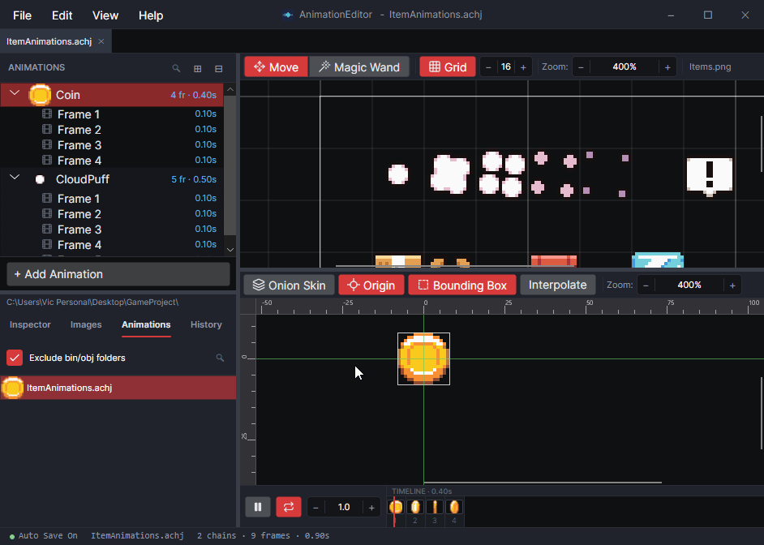
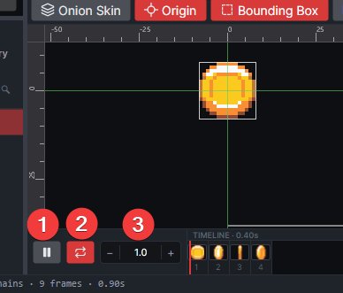
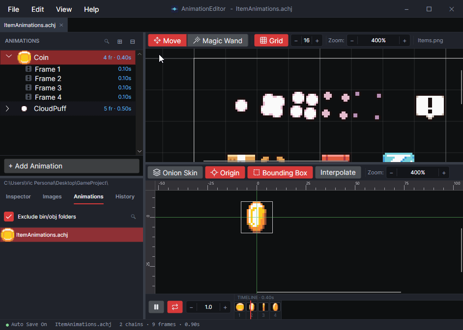

# Preview an Animation

## Animation Playback

Gum lets you preview an animation in the bottom half of the tool. Selected animations automatically play in the window.

<figure><figcaption>
Animations playing automatically when selected
</figcaption></figure>

Playback can be controlled through the timeline. The timeline allows for:

1. Play and pause
2. Repeating or play once
3. Playback speed

<figure><figcaption>
Timeline Controls
</figcaption></figure>

Note that the playback speed does not modify the actual animation - this only changes the speed in the preview window.

### Viewing Individual Frames

An animation can be viewed by clicking on the frame in the animation list, or by clicking on the timeline. Either stops playback and displays the selected frame.

<figure><figcaption>
Selecting a frame stops playback
</figcaption></figure>

### Viewing Multiple Animations

If multiple animations are selected, then the AnimationEditor displays both animations in the preview. Animations selected last draw on top.

<figure><figcaption>
Multiple selected animations overlapping
</figcaption></figure>

Animations can be individually started/stopped through the timeline, either by clicking on a frame or pause button.

<figure><figcaption>
Stopping/starting animations per timeline
</figcaption></figure>

